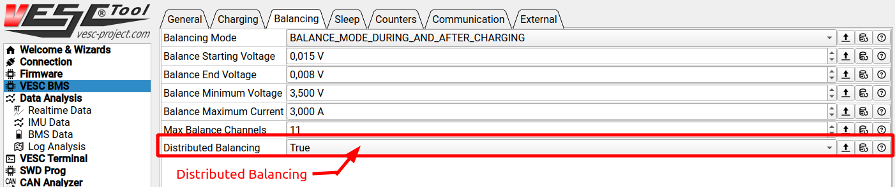
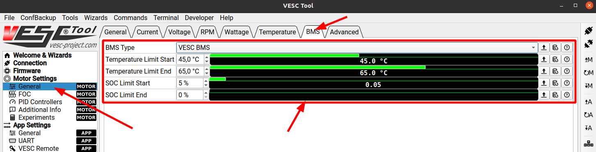
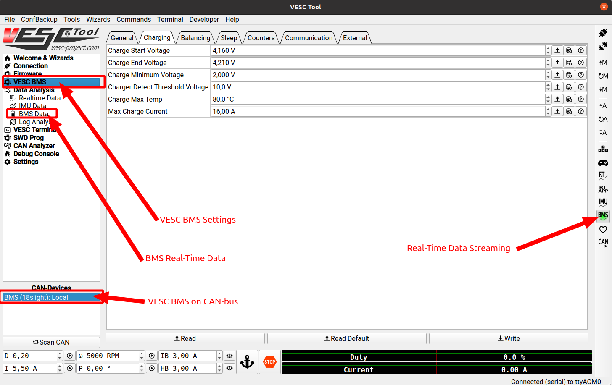
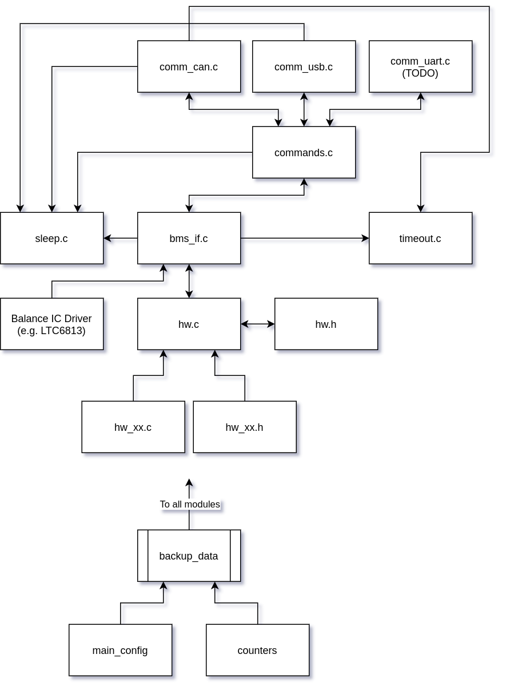

# VESC® BMS Firmware

This is the source code of the **VESC Battery Management System (BMS)** firmware. It is designed to integrate well with the [VESC motor control firmware](https://github.com/vedderb/bldc) as well as with [VESC Tool](https://github.com/vedderb/vesc_tool).

## Features
* Cell monitoring and balancing
* Charge control
* Balancing after charging
* Low-power sleep mode
* CAN-bus and USB
* Ah and Wh counting
* Multiple hardware configurations for different cell count and current measurement topologies
* Distributed balancing across multiple BMSes
* Bootloader and firmware update support with VESC Tool
* Full configuration support with VESC Tool

## Overview

The three main tasks of the VESC BMS are **1)** Cell Balancing, **2)** Charge Control and **3)** providing information to the power consumer (e.g. the VESC motor controller). The power consumer is then responsible for limiting the current draw based on the information provided by the VESC BMS.

### 1) Cell Balancing

Cell balancing is done by connecting a small load (in the form of a resistor) to cells with higher voltage than the cell with the lowest voltage until they reach the same voltage. There are a number of parameters that control how and when balancing is done. At some point they will be added to this document, but for now they can be found in the *VESC BMS -> Balancing* settings in VESC Tool when connected to the VESC BMS. Each parameter has a help text in VESC Tool.

#### Maximum Balancing Channels

To limit heat generation of the balancing resistors, the VESC BMS can limit the maximum number of simultaneous balancing channels. When the channels have to be limited, the cells that are most out of balance will have higher priority and will be balanced first. In most cases this should not increase the balancing time, as it will spread the heat generation more evenly over the balancing duration.

### Distributed Balancing

When multiple VESC BMSes are connected over CAN-bus, distributed balancing can be used. It is activated from the settings in VESC Tool:



When distributed balancing is activated, each VESC BMS will try to bring the cell voltages down to the lowest cell voltages of all BMSes on the CAN-bus. This is useful for connecting multiple battery packs that use the VESC BMS in series and/or parallel for creating a larger combined battery pack.

### 2) Charge Control

The VESC BMS assumes that a charger that does Constant Current / Constant Voltage (CC/CV) control is connected to the charge input. The charger can only see the entire pack voltage (not the individual cell voltages) and is not aware of temperatures or other fault conditions on the battery pack. Therefore the VESC BMS hardware has a minimum requirement to be able to disconnect the charger when e.g. a cell voltage rises too much or when any temperature limit is exceeded. Most hardware for the VESC BMS implements this with back-to-back MOSFETs that can disconnect the charger.

There is also a voltage sensor on the other side of the charge connector to allow the VESC BMS to detect when a charger is plugged in. When a fault conditions occurs that disconnects the charger, the charger must be unplugged and replugged before charging is attempted again.

### 3) Power Consumer Responsibilities

The VESC BMS is not designed to switch off the power consumer by itself, it relies on the power consumer to limit power consumption based on information provided by the VESC BMS. If something goes really wrong (such as a short circuit) there should be a fuse that prevents worse failures, such as a fire.

There are two reasons for putting the responsibility of limiting the power draw on the power consumer, namely:

1) Cutting power while drawing or feeding back a large current often leads to damage of the power consumer as this can result in large voltage spikes.

2) In many cases a soft ramp down in power is preferred over a hard cut, as hard cuts in torque are unexpected to the user. The risk of damaging battery cells by e.g. drawing or feeding back too much power to the cells is less severe than the risk of hurting the user from sudden changes in torque. A battery fire is very unlikely by drawing too much current or regenerating too much when braking. The main risk of battery fires is during charging and during uncontrolled short circuits, and that is handled by the main fuse and the charge control described above.

#### Provided Information

All information measured by the VESC BMS is available on the CAN-bus. The message *CAN\_PACKET\_BMS\_SOC\_SOH\_TEMP\_STAT* contains the most essential information for how to limit the current draw/regeneration. It has the following structure:

| Byte | Content | Unit |
|-----|-----|----|
| b[0] - b[1] | V\_CELL\_MIN | mV |
| b[2] - b[3] | V\_CELL\_MAX | mV |
| b[4] | State of Charge (SoC) | 0 - 255 |
| b[5] | State of Health (SoH) | 0 - 255 |
| b[6] | T\_CELL\_MAX | -128 - +127 degC |
| b[7] | State Bitfield | See below |

State Bitfield:

| B7 | B6 | B5 | B4 | B3 | B2 | B1 | B0 |
|-----|-----|----|----|----|----|----|----|
RSV | RSV | RSV | RSV | RSV | CHG_OK | IS\_BAL | IS_CHG |

The maximum cell temperature (T\_CELL\_MAX) and the state of charge (SoC) should be considered when determining how much current can be drawn or fed back to the battery pack. The VESC motor controller firmware does this, and has sensible default values, which can be changed from VESC Tool. These are the settings for controlling the BMS interaction in the VESC motor controller firmware:



**Note:** State of Health (SoH) estimation has not been implemented yet, so it will read 100 % until the implementation is done.

The other CAN-messages are not described here at the moment. They can be found in the file *comm\_can.c* in the source code.

### LED Functions

VESC BMS hardware has a red and a green LED. They have the following functions:

**Green LED**  

| Pattern | Meaning |
|----|----|
| Short pulse with several seconds interval | Software is in sleep mode. Every blink is a wakeup with some checks. |
| Slow blinking | Software is awake. |
| Fast blinking | Software is awake and woke up because USB was connected. |


**Red LED**  

| Pattern | Meaning |
|----|----|
| Off | Default State. |
| On steady | Balancing is ongoing |
| Blinking | A fault has occurred. The number of blinks between periods is the fault code. |

## Hardware

The firmware for the VESC BMS is modular and supports several hardware configurations, similar to how the VESC motor controller firmware works. It is centered around the STM32L476 microcontroller. The following is a high-level overview of a typical hardware running the VESC BMS firmware:


The minimum requirement for hardware running the VESC BMS firmware is:

* The STM32L476 microcontroller
* A supported cell balancing IC that can read all cell voltages, and connect a load to individual cells for balancing, such as the LTC6813
* A switch (e.g. back-to-back MOSFETs) for enabling and disabling the charger
* Voltage monitoring on the charger port for detecting when a charger is connected
* Charge current monitoring and/or total current monitoring

Additionally, the following hardware features are supported

* A temperature and humidity sensor (the HDC1080 is currently supported)
* One or more cell temperature sensors
* CAN-bus and a USB port
* One or more cell temperature sensors
* PCB temperature sensors

### Low Power Regulators

The VESC BMS relies on always having a 3.3V rail on STM32L4. Therefore the hardware must use DC/DC converters with a low no-load current and all parts on the 3.3V net must support low power sleeping or a switch to turn them off from the STM32.

The reason for the permanent 3.3V rail is for having the ability to continue balancing cells after disconnecting the charger, and for waking up and starting to run when there is data on the CAN-bus or when USB is connected.

### Example Schematic

When the first version of the VESC BMS hardware is released, schematics will become available on the [VESC Project website](https://vesc-project.com).

## VESC Tool Integration

When plugging in the VESC BMS over USB, or when connecting to it over CAN forwarding from a VESC, VESC Tool will only show the relevant pages for the VESC BMS as well as a configuration page for it:



The mobile version of VESC Tool also has a page for the BMS where all cell voltages, temperatures and some other information is shown.

### Configuration with VESC Tool

The VESC BMS firmware uses a different approach to configuration than the VESC motor controller firmware. In both cases there is an XML file that describes all configuration parameters, how they are grouped and how they are serialized. The difference is that the VESC motor control firmware relies on VESC Tool for loading the correct XML configuration for the firmware version, whereas the BMS firmware has a compressed version of the XML file built into the firmware. Every time VESC Tool connects to the VESC BMS, VESC Tool will read the compressed XML configuration, unpack it and set up a configuration page with the grouping and help texts provided in the compressed XML file. This has the advantage that VESC Tool does not need to know about the configuration in advance, and will even work for later or different versions of the VESC BMS firmware in the future.

This approach of compiling the configuration XML file into the firmware is useful for making various VESC Tool-compatible modules that connect over CAN-bus; VESC Tool can show configuration pages for them without knowing about them in advance.

## Sleep Mode

The VESC BMS will go to sleep after a configurable timeout, and wake up on regular intervals to check for events that should keep it awake. When a keep-awake-event is received, the sleep timer will be reset. The following events will reset the sleep timer:

* Balancing is active
* Charging is active
* VESC status messages are received on the CAN-bus
* Current above a configurable threshold is drawn or charged
* Any other VESC BMS on the CAN-bus is charging or balancing
* A USB-cable is connected

## Parameter and Counter Storage

Configuration parameters and the various counters (Ah charge/discharge, Wh charge/discharge) are stored in SRAM2, which is retained while sleeping, between resets and after firmware updates. This means that the configuration and counters will be retained between firmware updates if they are compatible between the firmwares. Configuration and counters are checked for compatibility independently, so a configuration structure update will still retain the counters.

### Power Loss
SRAM2 is retained during sleep mode, but it will be lost if power is lost. In most cases this does not matter as the BMS is connected to the battery at all times, but there are some situations where it is desirable to retain the configuration and counters when power is lost. To deal with that, SRAM2 is written to the [Parameter Backup](#flash-memory-layout) section in flash on the following occasions:

* When writing the BMS configuration
* When the charger is unplugged from the charging port
* When current measurement offset calibration is performed

If reading the backup from SRAM2 fails at boot, an attempt will be made to read it from flash. If that also fails, the default configuration will be loaded and all counters will be set to 0.

## Bootloader and Firmware Updates

The VESC BMS has a bootloader that works in the same was as the bootloader in the VESC motor controller firmware. VESC Tool can be used to upload new firmware to the VESC BMS. The bootloader can also be updated using VESC Tool.

## Timeout (watchdog)

The VESC BMS firmware uses a watchdog timer that will reset the CPU when processes are not responding in a timely manner. This is handled in the timeout module in the firmware.

### Slow operations

Some operations, such as erasing the flash memory for the new application and sleeping, take longer time to finish. When these operations are performed, the watchdog timer is configured to count slower. This way it can still reset the CPU if the slow operations freeze for some reason.

## Firmware Structure

The firmware is structured in a similar way to the VESC motor controller firmware. The file *conf\_general.h* is used to select hardware version for the supported hardwares:

```C
#if !defined(HW_SOURCE) && !defined(HW_HEADER)
//#define HW_HEADER				"hw_12s7p_v1.h"
//#define HW_SOURCE				"hw_12s7p_v1.c"

#define HW_HEADER				"hw_18s_light.h"
#define HW_SOURCE				"hw_18s_light.c"

//#define HW_HEADER				"hw_stormcore_bms.h"
//#define HW_SOURCE				"hw_stormcore_bms.c"
#endif
```

The hardware configurations then describe the details of how each hardware is implemented.

### Flash Memory Layout

This is the flash memory layout of the STM32L476 in the VESC BMS:


The first section contains the main program, after which the parameters from SRAM2 (see [Parameter and Counter Storage](#parameter-and-counter-storage)) are stored. After that there is empty space for storing the new main program during a firmware update, which then is written over the old main program by the bootloader that is stored in the last section.


### Firmware Diagram

This is a rough overview of how the different firmware modules are interconnected:



## Generate PDF Document

A PDF-version of this readme file can be generated using pandoc:

```bash
sudo apt install pandoc texlive-latex-extra
pandoc -f markdown-implicit_figures -o README.pdf README.md
```
